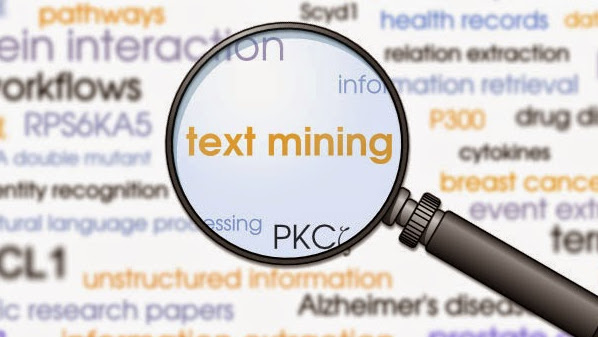

# Text-Mining-PUBMED-Pakistani-Students-Health



## What sort of documents are published on Pakistani students health? 


## Introduction #
The Project is focused on text mining the documents from PubMed.org related to Pakistani students health. 

## Data Source 
Source: [(here)](https://pubmed.ncbi.nlm.nih.gov/?term=pakistani+students+health).


### directory structure
------------

The directory structure of project:

```

├── README.md          <- The top-level README for project report.
├── data               <- MubMed.org downloaded documents 
├── lib                <- Custom modules
│   ├── PhraseMining_Utils.R     
│   ├── PubMed_Utils.R            
│   ├── SentimentAnalysis_Utils.R             
│   └── toDataFrame.R            

├── img                <- plots and images
│
├── main.R             <- main R file of the project
│
├── project.Rproj      <- R project file - R-Studio

